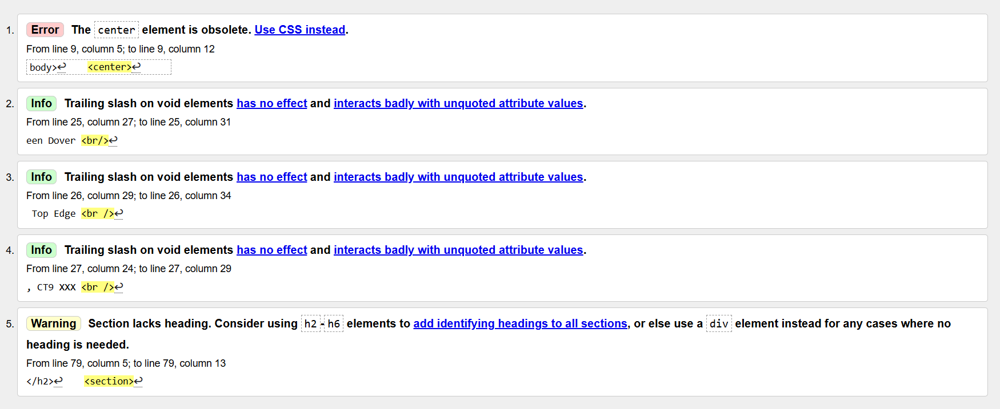

## 🧪 HTML Validation Attempt \[1]

### 📄 HTML Code

<details>
<summary>Click to expand code</summary>

```HTML
<!DOCTYPE html>
<html lang="en">
<head>
    <meta charset="UTF-8">
    <meta name="viewport" content="width=device-width, initial-scale=1.0">
    <title>Document</title>
</head>
<body>
    <center>
        <address>
        Dr. Eleanor Gaye
        Awesome Science Faculty
        University of Awesome
        Bobtown, CA 99999,
        USA
        Tel: 123-456-7890
        Email: no_reply@example.com
        </address>

        20 January 2016
    </center>


    <address>
        Miss Eileen Dover <br/>
        4321 Cliff Top Edge <br />
        Dover, CT9 XXX <br />
        UK
    </address>

    <h1>Re: Eileen Dover university application</h1>

    Dear Eileen,
    
    <p>Thank you for your recent application to join us at the University of Awesome’s science faculty to study as part of your
    PhD next year. I will answer your questions one by one, in the following sections.
    </p>

    <h2>Starting dates</h2>

    We are happy to accommodate you starting your study with us at any time, however it would suit us better if you could
    start at the beginning of a semester; the start dates for each one are as follows:
    
    <ul>
    <li>First semester: 9 September 2016</li>
    
    <li>Second semester: 15 January 2017</li>
    
    <li>Third semester: 2 May 2017</li>
    </ul>

    <p>Please let me know if this is ok, and if so which start date you would prefer.
    </p>

    <p>You can find more information about <a href="#">important university dates</a> on our website.
    </p>

    <h2>Subjects of study</h2>
    <p>
        At the Awesome Science Faculty, we have a pretty open-minded research facility — as long as the subjects fall somewhere
        in the realm of science and technology. You seem like an intelligent, dedicated researcher, and just the kind of person
        we’d like to have on our team. Saying that, of the ideas you submitted we were most intrigued by areas as follows, in
        order of priority:
        
        Turning H₂O into wine, and the health benefits of Resveratrol (C₁₄H₁₂O₃)
        
        Measuring the effect on performance of funk bassplayers at temperatures exceeding 30°C (86°F), when the audience size
        exponentially increases (effect of 3 × 10³ increasing to 3 × 10⁴).
        
        HTML and CSS constructs for representing musical scores.
        
        So please can you provide more information on each of these subjects, including how long you’d expect the research to
        take, required staff and other resources, and anything else you think we’d need to know? Thanks.
    </p>

    <h2>
        Exotic dance moves
    </h2>
    <section>
        <p>
            Yes, you are right! As part of my post-doctorate work, I did study exotic tribal dances. To answer your question, my
            favourite dances are as follows, with definitions:
        </p>
        Polynesian chicken dance
        A little known but very influential dance dating back as far as 300 BC; a whole village would dance around in a circle
        like chickens, to encourage their livestock to be “fruitful”.
        
        Icelandic brownian shuffle
        Before the Icelanders developed fire as a means of getting warm, they used to practice this dance, which involved
        huddling close together in a circle on the floor, and shuffling their bodies around in imperceptibly tiny, very rapid
        movements. One of my fellow students used to say that he thought this dance inspired modern styles such as Twerking.
        
        Arctic robot dance
        An interesting example of historic misinformation, English explorers in the 1960s believed to have discovered a new
        dance style characterized by “robotic”, stilted movements, being practiced by inhabitants of Northern Alaska and Canada.
        Later on however it was discovered that they were just moving like this because they were really cold.
        
        For more of my research, see my exotic dance research page.
    </section>

    <address>
    Yours sincerely,
    Dr. Eleanor Gaye
    </address>
    
    University of Awesome motto: "Be awesome to each other." — The memoirs of Bill S Preston, Esq.

</body>
</html>
```

</details>

---
### 🧾 W3C Validation Screenshot

Below is the W3C HTML validation result for this attempt:




---


### ✅ What I Learned


* **HTML5 vs. XHTML syntax:**
  I learned that in HTML5, self-closing tags like `<br/>` (common in XHTML) should be written simply as `<br>`.
  The trailing `/` has no effect and may cause issues when used with unquoted attributes, so it’s best avoided in HTML5.

*  **Proper use of the `<section>` element:**
  I discovered that every `<section>` in HTML5 is expected to have a heading (`<h2>`–`<h6>`) to describe its purpose.
  If a block of content does not require a heading, using a `<div>` instead of `<section>` is more appropriate.

* **Deprecated elements:**
  The `<center>` tag is obsolete in HTML5. For centering content, I should use CSS (e.g. `text-align: center;` within a `<div>`).

* **Importance of semantic structure:**
  Proper nesting of sections with headings improves accessibility and helps assistive technologies understand the content structure better.

---

### 🔧 Steps for Improvement (Next Attempt)


1. **Fix all `<br/>` tags**
   Replace XHTML-style line breaks (`<br/>` or `<br />`) with valid HTML5 syntax: `<br>`

2. **Add headings to all `<section>` elements**
   Make sure each `<section>` includes an appropriate `<h2>`–`<h6>` heading to describe its content.
   If a heading isn’t needed, use a `<div>` instead.

3. **Replace `<center>` with CSS-based centering**
   Avoid using the deprecated `<center>` tag. Wrap the content in a `<div>` and apply `style="text-align: center;"`.

4. **Maintain semantic clarity**
   Use HTML5 semantic elements (`<section>`, `<article>`, `<header>`, `<footer>`, etc.) meaningfully and avoid unnecessary or incorrect usage.

5. **Continue using W3C validator iteratively**
   Validate after every revision and log issues/fixes in the README to track progress.
